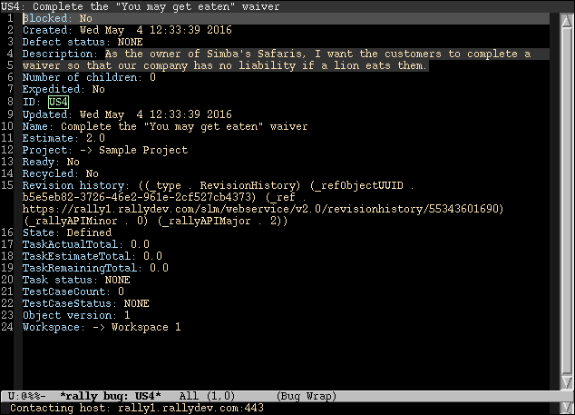
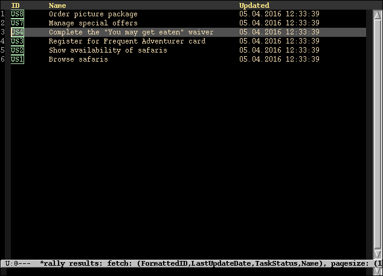
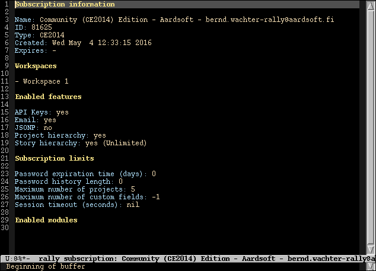
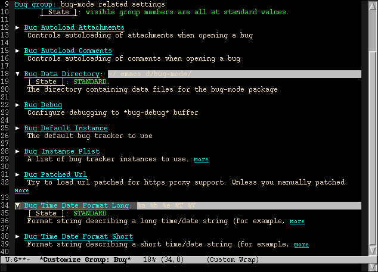
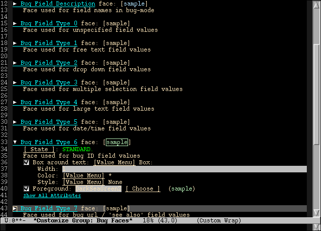
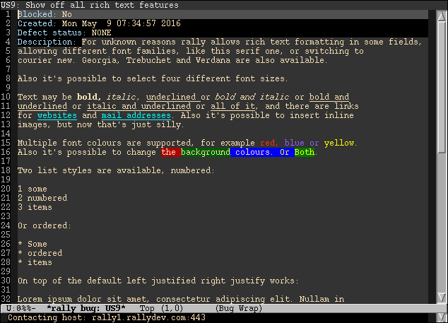

* bug-mode manual                                                     :TOC_4:
- [[#known-issues-and-limitations][Known issues and limitations]]
- [[#installation][Installation]]
  - [[#requirements][Requirements]]
- [[#supported-backends][Supported backends]]
  - [[#bugzilla-json-rpc][Bugzilla JSON-RPC]]
  - [[#rally-rest-api][Rally REST API]]
- [[#basic-usage][Basic usage]]
- [[#modes][Modes]]
  - [[#generic-modes][Generic modes]]
    - [[#bug-mode][bug-mode]]
      - [[#key-bindings][Key bindings]]
    - [[#bug-list-mode][bug-list-mode]]
      - [[#key-bindings-1][Key bindings]]
  - [[#rally-specific-modes][Rally specific modes]]
    - [[#bug-rally-subscription-mode][bug-rally-subscription-mode]]
- [[#search][Search]]
  - [[#bug-search][bug-search]]
  - [[#bug-search-jql][bug-search-jql]]
  - [[#jql-syntax][JQL syntax]]
  - [[#jql-field-mapping][JQL field mapping]]
- [[#interactive-functions][Interactive functions]]
  - [[#bug-cache-clear][bug-cache-clear]]
  - [[#bug-login-bugzilla][bug-login (/Bugzilla/)]]
  - [[#bug-logout-bugzilla][bug-logout (/Bugzilla/)]]
  - [[#bug-open][bug-open]]
  - [[#bug-rally-subscription-rally][bug-rally-subscription (/Rally/)]]
  - [[#bug-rally-list-projects-rally][bug-rally-list-projects (/Rally/)]]
  - [[#bug-rally-create-project-rally][bug-rally-create-project (/Rally/)]]
  - [[#bug-search-1][bug-search]]
  - [[#bug-search-jql-1][bug-search-jql]]
  - [[#bug-search-project][bug-search-project]]
  - [[#bug-search-jql-project][bug-search-jql-project]]
  - [[#bug-stored-bugs][bug-stored-bugs]]
- [[#customization][Customization]]
- [[#org-mode-integration][org-mode integration]]
- [[#proxy-use][Proxy use]]
  - [[#use-port-forwarding][Use port forwarding]]
  - [[#use-a-proxy-aware-tls-program][Use a proxy aware TLS program]]
- [[#rich-text-formatting][Rich text formatting]]
- [[#related-modes-and-modules][Related modes and modules]]
  - [[#rally-mode][rally-mode]]
  - [[#bugz-mode][bugz-mode]]
  - [[#ghel][gh.el]]
  - [[#jira-rest][jira-rest]]
  - [[#jirael][jira.el]]

* Known issues and limitations
To get an overview of open issues, report bugs, or suggest improvements please visit the [[https://github.com/bwachter/bug-mode/issues][GitHub issue tracker]].

To report a bug, please first try if you can reproduce it. If you can, temporarily enable debug output for both bug-mode (=(setq bug-debug t)=) and url (=(setq url-debug t)=), reproduce the issue again, and include the contents of the =*bug-debug*= and =*URL-DEBUG*= buffers with your bug report. Make sure to replace the contents of /Authorization/ and /zsessionid/ headers before submission. Also include backtraces, if any.

If you're interested in contributing please have a look at the [[./hacking.org][developer documentation]].

* Installation
** Requirements
- [[http://cvs.savannah.gnu.org/viewvc/*checkout*/emacs/lisp/json.el?root=emacs][json.el]], which nowadays should be included in your copy of emacs already.
* Supported backends
** Bugzilla JSON-RPC
For historical reasons the API used for Bugzilla is the [[https://www.bugzilla.org/docs/4.0/en/html/api/Bugzilla/WebService/Server/JSONRPC.html][JSON-RPC API]], which has been deprecated. Currently this is used as default API if no bug tracker type has been configured. In the future it is expected to keep the JSON-RPC API for backwards compatibility with older instances, but implement the [[https://bugzilla.readthedocs.io/en/5.0/api/index.html][REST WebService API]] as additional backend for newer Bugzilla instances.

A Bugzilla instance >= 3.6 with JSON-RPC enabled is required.
** Rally REST API
For Rally REST/JSON based [[https://techdocs.broadcom.com/us/en/ca-enterprise-software/valueops/rally/rally-help/reference/rally-web-services-api.html][Web Services API]] in version 2 is implemented (the latest version at the moment of writing this manual).
** GitHub REST API
The GitHub backend uses the [[https://docs.github.com/en/rest][GitHub REST API]] to access issues.  It supports read operations, basic search, and project listing.  Configure it with =:type github= and a personal access token in =:api-key=.
* Basic usage
* Modes
** Generic modes
*** bug-mode
     :PROPERTIES:
     :CUSTOM_ID: bug-mode
     :END:
=bug-mode= is used to display details for a single bug, either from a search result or by searching/[[#bug-open][opening a single bug]].

#+CAPTION: A single Rally bug

**** Key bindings
- RET - open attachment with browse-url function
- b - open bug in default browser
- c - add comment (deprecated, will be removed)
- d - download attachment with w3m-download
- e - edit the field near point, if editable
- i - display information about thing at point (debug functionality)
- r - remember the bug in a locally stored list
- s - resolve the bug (deprecated, will be removed)
- u - execute query again and update bug buffer
- q - kill bug buffer
- C-c C-c - Commit changes made to the bug tracker

The keybindings marked as deprecated rely on Bugzilla specific behaviour, and will be removed or change behaviour once backend agnostic support for those features is available.

*** bug-list-mode
     :PROPERTIES:
     :CUSTOM_ID: bug-list-mode
     :END:
=bug-list-mode= is used to display a list of bugs, usually as a result of a search. Full bugs can be opened in =bug-mode= either from the keyboard by navigating to an entry and pressing =RET=, or by mouse using either the left or the middle button.

#+CAPTION: A search result of Rally bugs

**** Key bindings
- RET - open bug at point
- i - display information about thing at point (debug functionality)
- u - execute query again and update search buffer
- q - kill search buffer

** Rally specific modes
    :PROPERTIES:
    :CUSTOM_ID: bug-rally-subscription-mode
    :END:
*** bug-rally-subscription-mode
Use the =bug-rally-subscription= function to display details about your Rally subscription.
#+CAPTION: Sample output for a Rally subscription

* Search
  :PROPERTIES:
  :CUSTOM_ID: search
  :END:

bug-mode provides four search commands:

| Command                 | Syntax | Scope        |
|-------------------------+--------+--------------|
| =bug-search=            | Native | Unscoped     |
| =bug-search-jql=        | JQL    | Unscoped     |
| =bug-search-project=    | Native | Project      |
| =bug-search-jql-project=| JQL    | Project      |

Unscoped searches query all accessible projects.  Project-scoped searches
restrict results to the instance's =:project-id= (or the buffer-local
=bug---project= variable when set).  Backends that do not support project
scoping ignore the restriction.

All four commands open their results in [[#bug-list-mode][bug-list-mode]], or jump directly to
[[#bug-mode][bug-mode]] when there is exactly one result.  With a prefix argument
(=C-u=) any command also prompts for the instance to search.

** bug-search
   :PROPERTIES:
   :CUSTOM_ID: bug-search-1
   :END:

=bug-search= accepts a single query string in the backend's native syntax.

Bugzilla supports:
- free-form text search (matches the summary field)
- =key:value= pairs, e.g. =component:Test=
- direct bug IDs

Rally supports:
- free-form text search (matches Name, Notes and Description)
- Rally formatted IDs such as =US123= or =DE456= (opens directly)
- full Rally WSAPI expressions using parenthesis syntax, e.g.
  =(ScheduleState = "In-Progress") AND (Owner.Name contains "alice")=
- an empty query to list all items in the configured project

GitHub supports:
- free-form text search (searches issue title and body)
- direct issue numbers (e.g. =#42=)
- =repo:owner/name= style qualifiers when no project-id is configured

** bug-search-jql
   :PROPERTIES:
   :CUSTOM_ID: bug-search-jql
   :END:

=bug-search-jql= takes a query written in [[https://support.atlassian.com/jira-software-cloud/docs/what-is-advanced-search-in-jira-cloud/][JQL]] and translates it to each
backend's native query language.  This allows you to use one search syntax
across Bugzilla, Rally, and any future backends that support it.

JQL queries use the standard Jira field names listed below.  Unsupported fields
or operators are passed through untranslated, so you can mix generic and native
field names in the same query.

Supported JQL syntax:
- Field comparison: =summary = "foo"=
- Substring search: =text ~ "foo"=  (translated to the backend's text-search field)
- Logical AND/OR: =status = "Open" AND priority = "High"=
- Grouping: =(status = "Open" OR status = "In Progress") AND assignee = "alice"=
- ORDER BY: =ORDER BY updated DESC=

Not yet supported:
- =IN= and =NOT IN= lists (Bugzilla only)
- Parenthesized negation (=NOT (a AND b)=)
- Functions other than bare word names (=currentUser()= works)

** JQL syntax
   :PROPERTIES:
   :CUSTOM_ID: jql-syntax
   :END:

The JQL parser recognises the following operators:

| Operator | Meaning       | Backend support                          |
|----------+---------------+------------------------------------------|
| ===       | equals        | Bugzilla, Rally, GitHub                  |
| =!=      | not equals    | Rally                                    |
| =~       | contains      | Rally, Bugzilla (maps to substring)      |
| =!~=     | not contains  | Rally                                    |
| =>       | greater than  | Rally                                    |
| =<       | less than     | Rally                                    |
| =>==     | greater/equal | Rally                                    |
| =<==     | less/equal    | Rally                                    |
| =IN=     | in list       | Rally                                    |
| =NOT IN= | not in list   | Rally                                    |

** JQL field mapping
   :PROPERTIES:
   :CUSTOM_ID: jql-field-mapping
   :END:

The JQL translator maps Jira-standard field names to backend-specific names.
Field names are case-insensitive.  Unknown field names are passed through
as-is, letting you use native backend fields when the generic mapping does not
fit.

| JQL field   | Bugzilla       | Rally          | GitHub     | Meaning                |
|-------------+----------------+----------------+------------+------------------------|
| =text=      | =summary=      | =Name=         | =title=    | full-text / summary    |
| =summary=   | =summary=      | =Name=         | =title=    | title / name           |
| =status=    | =status=       | =ScheduleState=| =state=    | workflow status        |
| =assignee=  | =assigned_to=  | =Owner=        | =assignee= | person assigned        |
| =reporter=  | =reporter=     | =SubmittedBy=  | =user=     | person who created     |
| =creator=   | =reporter=     | =SubmittedBy=  | =user=     | alias for =reporter=   |
| =priority=  | =priority=     | =Priority=     | (none)     | priority level         |
| =issuetype= | =component=    | =Type=         | (none)     | work item type         |
| =type=      | =component=    | =Type=         | (none)     | alias for =issuetype=  |
| =project=   | =product=      | =Project=      | (none)     | project / product       |
| =created=   | =creation_time=| =CreationDate= | =created_at=| creation timestamp    |
| =updated=   | =last_change_time= | =LastUpdateDate= | =updated_at= | last update timestamp |
| =description= | =description= | =Description=  | =body=     | description            |
| =labels=    | =keywords=     | =Tags=         | =labels=   | tags / keywords        |
| =key=       | =id=           | =FormattedID=  | =number=   | friendly identifier    |
| =id=        | =id=           | =ObjectUUID=   | =id=       | internal identifier    |
| =component= | =component=    | (none)         | (none)     | component / sub-project  |
| =resolution= | =resolution=  | =Resolution=   | (none)     | resolution state       |

* Interactive functions
** bug-cache-clear
Clear cached data, either globally, or -- when called with prefix argument -- for a particular instance.
** bug-login (/Bugzilla/)
Explicitely log in to a Bugzilla instance.
** bug-logout (/Bugzilla/)
Explicitely log out from a Bugzilla instance.
** bug-open
   :PROPERTIES:
   :CUSTOM_ID: bug-open
   :END:
Open a single bug, taking the /internal/ bug ID as argument. For Bugzilla the internal and user visible bug ID are identical, while for Rally the user friendly ID (like "US123") and the internal bug ID don't match.

For bug trackers like Rally you can use =bug-search= with a bug reference as argument, which will resolve the internal ID, and open it via =bug-open=, at the cost of one additional API call.
** bug-rally-subscription (/Rally/)
Entry point to [[#bug-rally-subscription-mode][bug-rally-subscription-mode]]
** bug-rally-list-projects (/Rally/)
Create a new project in a Rally workspace.
** bug-rally-create-project (/Rally/)
List all projects for the current Rally instance. =bug-rally-projects-from-workspace= controls how to pull project information. When it is =nil= (default) it'll use a direct project query, which will list all open projects. When set to =t= a workspace query will be used instead, which applies Rally side filtering.

Project IDs for setting a default project can be copied from the project list.
** bug-search
   :PROPERTIES:
   :CUSTOM_ID: bug-search
   :END:
Search using the backend's native query syntax.  See the [[#search][Search]] section for
the full syntax reference per backend.
** bug-search-jql
   :PROPERTIES:
   :CUSTOM_ID: bug-search-jql-1
   :END:
Search using JQL (Jira Query Language) syntax translated to the backend's native
query language.  See the [[#bug-search-jql][bug-search-jql]] section for the full syntax reference.
** bug-search-project
   :PROPERTIES:
   :CUSTOM_ID: bug-search-project
   :END:
Project-scoped native search.  The query is restricted to the instance's
`:project-id' (or the buffer-local `bug---project' when set).  See
[[#search][Search]] for syntax details.
** bug-search-jql-project
   :PROPERTIES:
   :CUSTOM_ID: bug-search-jql-project
   :END:
Project-scoped JQL search.  The query is restricted to the instance's
`:project-id' (or the buffer-local `bug---project' when set).  See
[[#bug-search-jql][bug-search-jql]] for syntax details.
** bug-stored-bugs
Open a list of locally stored bugs.

* Customization
As enduser it's recommended to configure bug-mode using Emacs "Easy Customization Interface", invoked with =M-x customize-group RET bug=:

#+CAPTION: Customization screen

The easiest way to change the faces used in bug mode is via =M-x customize-group RET bug-faces=:

#+CAPTION: Customization screen for faces

* org-mode integration
To enable basic org-mode integration do a =(require 'org-bug)= /after/ initializing bug-mode.  This provides two hyperlink types:

| Link type     | Format                        | Opens with |
|---------------+-------------------------------+------------|
| =bug=        | =instance/bug-id=             | =bug-open= |
| =bug-search= | =instance[/jql][/project]/query= | see below |

The instance identifier may not be omitted.

The =bug= link type opens a single bug by its unique identifier.  For Rally:
=bug::test-rally/adff50be-40ec-4739-8615-d77ac5429bac=.

The =bug-search= link type supports both native and JQL queries, with
optional project scoping encoded in the path:

| Link path                        | Mode      | Scope          |
|----------------------------------+-----------+----------------|
| =instance/query=                 | Native    | Unscoped       |
| =instance//query=              | Native    | Default project|
| =instance/pid/query=             | Native    | Project = pid  |
| =instance/jql/query=           | JQL       | Unscoped       |
| =instance/jql//query=           | JQL       | Default project|
| =instance/jql/pid/query=        | JQL       | Project = pid  |

A double slash (=/=) immediately after the instance (or after =jql/=)
selects the instance's default project (=:project-id=).  A non-empty
project-id between slashes scopes the search to that specific project.

Examples:
- =bug-search::test-rally/may get eaten= — native text search across all projects
- =bug-search::test-rally//Owner = "alice"= — native search in default project
- =bug-search::test-rally/jql/status = "Open"= — JQL search across all projects
- =bug-search::test-rally/jql//assignee = "alice"= — JQL search in default project

The org-mode integration supports [[http://orgmode.org/manual/Capture.html][org-capture]] from bug-mode and bug-list-mode
buffers.  =org-capture= in a bug-mode buffer stores a =bug:= link.  In a
search result buffer it stores a =bug-search= link with the correct =jql=
and project segments.

* Proxy use
We used to ship a workaround for broken https proxy support in URL (see [[https://debbugs.gnu.org/cgi/bugreport.cgi?bug=11788][bug 11788]]).
This should have been fixed since emacs 26 - which was a while ago, so the following
snippet should not just work for accessing https enabled bug trackers through a proxy:

#+BEGIN_SRC emacs-lisp
(setq url-proy-services
      '(("no_proxy" . "^\\((localhost\\|10.*\\)")
        ("http" . "a.proxy.example")
        ("https" . "a.proxy.example")))
#+END_SRC

If your environment doesn't work still you can try one of the workarounds in the following
sections.

** Use port forwarding
If your proxy allows using =CONNECT=, and you have a suitable shell host
available you can use this to forward a local port to Rally, bypassing the
whole proxy mess. An example entry for =~/.ssh/config= could look like this:

#+BEGIN_SRC
Host rally-forward
    ProxyCommand /usr/bin/connect-proxy -H a.proxy.example:8080 a.shellhost.example 443
    LocalForward 9900 rally1.rallydev.com:443
#+END_SRC

Additionally =/etc/hosts= needs =rally1.rallydev.com= added after =127.0.0.1=
to have it resolve to localhost, and the URL bug-mode uses to access Rally needs
to be adjusted to include the locally bound port:

#+BEGIN_SRC emacs-lisp
(setq bug-rally-url "https://rally1.rallydev.com:9900/slm/webservice/v2.0/")
#+END_SRC

After starting a SSH connection (=ssh rally-forward=) you should be able to use
 bug-mode without issues.

** Use a proxy aware TLS program
OpenSSL's s_client [[https://rt.openssl.org/Ticket/Display.html?id=2651&user=guest&pass=guest][gained proxy support in trunk]]. Assuming your network allows
host resolution it might be possible to use this as workaround:

#+BEGIN_SRC emacs-lisp
;; disable builtin gnutls
(if (fboundp 'gnutls-available-p)
    (fmakunbound 'gnutls-available-p))

;; set openssl compiled from trunk as tls-program
(setf tls-program
      '("openssl-trunk s_client -connect %h:%p -proxy a.proxy.example:8080 -ign_eof"))
#+END_SRC

Note that this will bypass the whole noproxy logic, so if you're using tls in
the local network without proxy as well this will break things.

* Rich text formatting
Rally supports "Rich Text" (they mean "HTML") for some fields. While for most of the options the value is questionable, and looks more like "Look! We can do fancy text too!", the list formatting and the option to emphasize text using bold/italics/underline are quite useful. Even though a few more formatting options are supported you should limit yourself to those.

A rendering of a bug using /all/ of Rallys Rich Text elements looks like this:

#+CAPTION: Rendering of all Rally Rich Text elements

* Related modes and modules
** [[https://github.com/seanleblanc/rally-mode][rally-mode]]
=rally-mode= queries all /tasks/ for the user in the current iteration, and allows displaying details. This only works if tasks are added to an iteration, not user stories.

A very similar result can be obtained with bug-mode with the following code:

#+BEGIN_SRC emacs-lisp
(bug--do-rally-search
 '((resource . "Task")
   (list-columns . ("FormattedID" "Name" "State" "Estimate" "ToDo"))
   (data .
         ((fetch "true,WorkProduct,Tasks,Iteration,Estimate,State,ToDo,Name,Description,Type,FormattedID")
          (query "(( Owner.Name = <your_user> ) AND (( Iteration.StartDate <= today ) AND ( Iteration.EndDate >= today )))"))))
 :<rally-instance>)
#+END_SRC

To query for user stories instead of tasks replace the =Task= with =HierarchicalRequirement=

** [[http://www.jemarch.net/git/bugz-mode.git/][bugz-mode]]
A mode for using Bugzilla, wrapping the pybugz utility. Of limited use, as
pybugz is rather picky about which Bugzilla instances it likes to work with.
** [[https://github.com/sigma/gh.el][gh.el]]
A library wrapping most of GitHubs API. For adding GitHub issues to bug-mode
just directly querying the GitHub API might be easier.
** [[https://github.com/mattdeboard/jira-rest][jira-rest]]
A library for using Jiras REST API.
** [[https://github.com/unmonoqueteclea/jira.el][jira.el]]
Another jira integration
